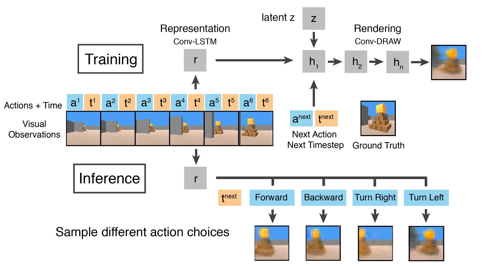

## Action-conditional Scene Rendering for RL agents in 3D Games

 

 
Left: ground truth visual observations. Right: rendered observations conditioned on the agent's actions. 

For AI to learn complex vision tasks in the 3D world, an effective representation of the 3D visual environment is critical. However, it's often hard to train representations of complex 3D environments based on visual inputs, and agents trained on raw pixels often do not perform well.  One common alternative is to replace visual inputs with sensor inputs, and another is to train a separate network to transform visual inputs to handcrafted features. These appoarches, combined with model-free reinforcement learning algorithms, can achieve good results, but are unlikely to scale to more complex visual environments.  

Humans (and other animals), on the other hand, use intrinsic predictive models of the 3D environment to navigate in the real world. Such models not only encode the current visual inputs but are also able to predict what future scenes would look like after performing different actions. Here, we develops **a predictive vision model for agents to effectively encode 3D game environments and render future scenes conditioned on current actions**. 

### Unity ML-Agents Toolkit
For game engine and training data, we use 3D Unity games from the the [Unity ML-Agents Toolkit](https://github.com/Unity-Technologies/ml-agents). Game builds and training data can be found [here](https://github.com/yueqiw/gqn-world-model/releases/). Example notebook for scene rendering can be found [here](notebooks/unity_predict_pyramids_video.ipynb). 

### Generative query network (GQN)
This work leverages the [Generative query network (GQN)](https://deepmind.com/blog/neural-scene-representation-and-rendering/), which is a novel approach for learning robust representation conditional rendering of 3D environments without human labeling. 

### World Models 
Our model is also inspired by the ideas from [World Models](https://worldmodels.github.io), which is a promising direction in model-based reinforcement learning that aims to learn a dynamic model of the agent's game environment.

 

 
The generative query network for action-conditional scene rendering

### Credits

@yueqiw @GilbertZhang @DorisHYC

GQN code template: @wohlert [generative-query-network-pytorch](<https://github.com/wohlert/generative-query-network-pytorch>)

This project started during the COMS4995 Deep Learning course at Columbia, advised by Prof. [Iddo Drori](https://www.cs.columbia.edu/~idrori/). 

### References

Juliani, A., Berges, V., Vckay, E., Gao, Y., Henry, H., Mattar, M., Lange, D. (2018). Unity: A General Platform for Intelligent Agents. arXiv preprint arXiv:1809.02627. https://github.com/Unity-Technologies/ml-agents.

Eslami, S. M. A. et al. (2018) Neural scene representation and rendering. Science. or [preprint](https://deepmind.com/documents/211/Neural_Scene_Representation_and_Rendering_preprint.pdf)

Ha, D. & Schmidhuber, J. (2018). World Models. https://arxiv.org/abs/1803.10122 

